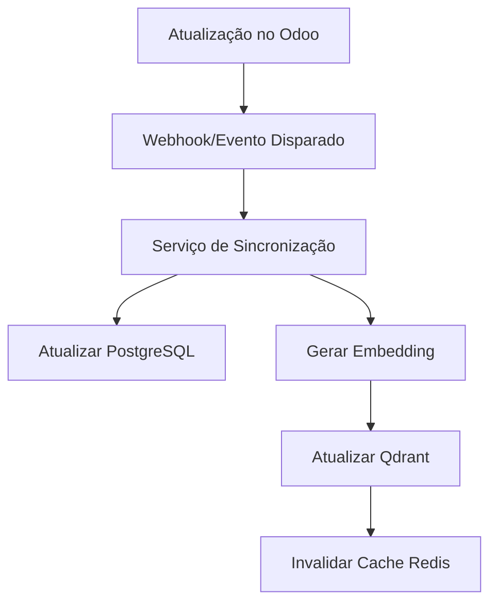

# Arquitetura Hub-and-Spoke com Data Services e Sistema de Plugins Integrados

## Índice

1. [Visão Geral](#visão-geral)
2. [Registro Dinâmico de Serviços](#registro-dinâmico-de-serviços)
3. [Serviços Principais](#serviços-principais)
4. [Agentes de Data Services](#agentes-de-data-services)
5. [Diagrama da Arquitetura Integrada](#diagrama-da-arquitetura-integrada)
6. [Integração Completa com Odoo](#integração-completa-com-odoo)
7. [Sistema de Plugins](#sistema-de-plugins)
8. [Considerações Futuras e Próximos Passos](#considerações-futuras-e-próximos-passos)
9. [Conclusão](#conclusão)

## Visão Geral

Este documento apresenta uma arquitetura aprimorada para o sistema ChatwootAI, evoluindo a estrutura hub-and-spoke com uma camada de Data Services centralizada, um sistema de plugins extensível e integração com Odoo. Esta evolução mantém a distribuição lógica dos agentes enquanto melhora significativamente:

1. A eficiência da comunicação entre componentes
2. A economia de tokens em interações LLM
3. A integração completa com sistemas ERP (especialmente Odoo)
4. O gerenciamento de estado e contexto entre agentes
5. A flexibilidade para suportar diferentes domínios de negócio
6. A capacidade de estender o sistema através de plugins especializados
7. O gerenciamento centralizado de metadados de produtos para busca semântica

A proposta é especialmente otimizada para as operações de Vendas, Delivery, Suporte, Informações e Agendamentos, garantindo que cada componente funcional tenha acesso eficiente aos dados necessários para executar suas tarefas.

## Arquitetura Atual vs. Arquitetura Expandida

### Arquitetura Atual

A arquitetura atual segue um modelo hub-and-spoke de três camadas:

1. **Camada de Canais (Channel Crews)**: Integração com WhatsApp, Instagram, etc.
2. **Camada de Orquestração (Hub Crew)**: Orquestração central com OrchestratorAgent, ContextManagerAgent e IntegrationAgent
3. **Camada Funcional (Functional Crews)**: Especialização em domínios como SalesCrew, SupportCrew, InfoCrew, etc.

Principais limitações identificadas:
- Acesso duplicado aos dados por diferentes agentes
- Acoplamento entre lógica de negócio e acesso a dados
- Uso ineficiente de contexto em trocas de LLM
- Falta de abstração para operações em bancos de dados
- Integração limitada com sistemas externos como Odoo
- Gerenciamento centralizado insuficiente para metadados ricos de produtos

### Arquitetura Expandida

A arquitetura expandida adiciona uma camada de Data Services centralizada e um sistema de plugins, mantendo o modelo hub-and-spoke para orquestração de mensagens:

1. **Camada de Canais (Channel Crews)**: Sem alterações
2. **Camada de Orquestração (Hub Crew)**: Integração com DataServiceHub e PluginManager
3. **Camada Funcional (Functional Crews)**: Melhoria na especialização para domínios específicos
4. **Camada de Data Services**: Interface unificada para todos os serviços de dados
5. **Sistema de Plugins**: Mecanismo para estender funcionalidades específicas de domínio
6. **Integração com Odoo**: Conexão bidirecional com módulos do Odoo

## Componentes Principais da Arquitetura

### 1. DataServiceHub

Componente central que coordena todas as interações de dados, implementado como Singleton para garantir um único ponto de acesso:

```python
class DataServiceHub:
    """
    Hub central para todos os serviços de dados, fornecendo uma interface unificada
    para acessar diferentes tipos de dados.
    """
    
    _instance = None
    
    @classmethod
    def get_instance(cls, config=None):
        """Obtém a instância singleton do DataServiceHub."""
        if cls._instance is None:
            cls._instance = cls(config)
        return cls._instance
    
    def __init__(self, config=None):
        """Inicializa o DataServiceHub com as conexões necessárias."""
        self.config = config or self._load_config_from_env()
        
        # Verificar se estamos em modo de desenvolvimento
        self.dev_mode = os.environ.get('DEV_MODE', 'false').lower() == 'true'
        
        # Inicializar conexões
        self.pg_conn = None
        self.redis_client = None
        self.sqlite_conn = None
        
        # Em modo de desenvolvimento, usar SQLite
        if self.dev_mode or not POSTGRES_AVAILABLE:
            self._init_sqlite_connection()
        else:
            # Em modo de produção, usar PostgreSQL e Redis
            self.pg_conn = self._init_postgres_connection()
            self.redis_client = self._init_redis_connection()
        
        # Dicionário para armazenar serviços registrados
        self.services = {}
        
        # Cache L1 (memória local) - mais rápido, capacidade limitada
        self.l1_cache = {}
        
        # Registrar serviços padrão
        self._register_default_services()
        
    def _register_default_services(self):
        """Registra os serviços padrão que são carregados automaticamente."""
        # Serviços principais implementados
        services_to_register = {
            'ProductDataService': ('product_data_service', 'ProductDataService'),
            'CustomerDataService': ('customer_data_service', 'CustomerDataService'),
            'ConversationContextService': ('conversation_context_service', 'ConversationContextService'),
            'ConversationAnalyticsService': ('conversation_analytics_service', 'ConversationAnalyticsService'),
            'domain_rules': ('domain_rules_service', 'DomainRulesService')
        }
        
        # Importar e registrar dinamicamente
        for service_name, (module_name, class_name) in services_to_register.items():
            try:
                import importlib
                full_module_name = f".{module_name}"
                module = importlib.import_module(full_module_name, package="services.data")
                service_class = getattr(module, class_name)
                
                # Instanciar e registrar
                service_instance = service_class(self)
                self.register_service(service_name, service_instance)
            except (ImportError, AttributeError) as e:
                logger.warning(f"Não foi possível carregar o serviço {service_name}: {str(e)}")
                
    def get_service(self, service_type):
        """Obtém uma instância do serviço de dados pelo tipo."""
        return self.services.get(service_type)
        
    def register_service(self, service_type, service_instance):
        """Registra um serviço no hub."""
        self.services[service_type] = service_instance
        logger.info(f"Serviço '{service_type}' registrado com sucesso")
        
    def query(self, service_type, query_params, context=None):
        """Executa uma consulta no serviço especificado."""
        service = self.get_service(service_type)
        if not service:
            raise ValueError(f"Serviço de dados '{service_type}' não encontrado")
        return service.query(query_params, context)
        
    def write(self, service_type, data, context=None):
        """Escreve dados no serviço especificado."""
        service = self.get_service(service_type)
        if not service:
            raise ValueError(f"Serviço de dados '{service_type}' não encontrado")
        return service.write(data, context)
```

### 2. Sistema de Plugins

O sistema de plugins permite estender as funcionalidades do ChatwootAI de forma modular:

```python
class PluginManager:
    """
    Gerenciador de plugins do ChatwootAI.
    
    Responsável por carregar, inicializar e gerenciar os plugins do sistema,
    permitindo a extensão das funcionalidades para diferentes domínios de negócio.
    """
    
    def __init__(self, config):
        """Inicializa o gerenciador de plugins."""
        self.config = config
        self.plugins = {}
        self.plugin_configs = config.get("plugins", {})
        self.plugin_paths = config.get("plugin_paths", ["src.plugins"])
    
    def discover_plugins(self):
        """Descobre os plugins disponíveis no sistema."""
        discovered_plugins = []
        
        # Plugins configurados explicitamente
        if "enabled_plugins" in self.config:
            return self.config["enabled_plugins"]
        
        # Descoberta automática baseada no domínio de negócio ativo
        active_domain = self.config.get("active_domain")
        if active_domain and "plugins" in active_domain:
            return active_domain["plugins"]
        
        return discovered_plugins
    
    def load_plugin(self, plugin_name):
        """Carrega um plugin pelo nome."""
        # Implementação do carregamento dinâmico de plugins
        pass
    
    def get_plugin(self, plugin_name):
        """Obtém uma instância de plugin pelo nome."""
        if plugin_name not in self.plugins:
            self.load_plugin(plugin_name)
        return self.plugins.get(plugin_name)
```

### 3. Domain Rules Service

O DomainRulesService é um componente crucial que gerencia as regras de negócio e integra-se com o Odoo:

```python
class DomainRulesService:
    """
    Serviço para gerenciar regras de negócio entre diferentes domínios.
    
    Este serviço é responsável por:
    1. Gerenciar regras de negócio (políticas, restrições, etc.)
    2. Fornecer informações sobre produtos específicos do domínio
    3. Responder a perguntas frequentes (FAQs)
    4. Gerenciar regras de desconto e promoções
    5. Estabelecer integração com sistemas Odoo para regras dinâmicas
    """
    
    def __init__(self, data_service_hub):
        self.data_service_hub = data_service_hub
        self.cache = {}
        self.business_rules = {}
        self.faqs = {}
        self.config = self._load_config()
        
        # Inicializar cliente Qdrant para busca semântica
        self.qdrant_client = self._init_qdrant_client()
        self.collection_name = "business_rules"
        self._ensure_collection_exists()
        
        # Inicializar conexão com Odoo (se disponível)
        self.odoo_connection = self._init_odoo_connection()
        
        # Carregar regras iniciais
        self._load_business_rules()
        
    def query_rules(self, query_text, domain_id=None, rule_type=None, limit=5):
        """Consulta regras de negócio baseadas em texto usando busca semântica."""
        # Implementação de busca semântica com Qdrant
        vector = self._text_to_vector(query_text)
        filters = {}
        
        if domain_id:
            filters["domain_id"] = domain_id
        if rule_type:
            filters["rule_type"] = rule_type
            
        results = self.qdrant_client.search(
            collection_name=self.collection_name,
            query_vector=vector,
            query_filter=filters,
            limit=limit
        )
        
        return [self._format_rule_result(hit) for hit in results]
    
    def index_business_rules(self, domain_id=None):
        """Indexa regras de negócio no Qdrant para busca semântica."""
        # Obter regras do Odoo ou banco de dados local
        rules = self._get_rules_from_source(domain_id)
        
        # Vetorizar e indexar regras
        for rule in rules:
            vector = self._text_to_vector(rule["description"])
            self.qdrant_client.upsert(
                collection_name=self.collection_name,
                points=[
                    {
                        "id": rule["id"],
                        "vector": vector,
                        "payload": {
                            "domain_id": rule["domain_id"],
                            "rule_type": rule["rule_type"],
                            "description": rule["description"],
                            "details": rule["details"],
                            "created_at": rule["created_at"],
                            "updated_at": rule["updated_at"]
                        }
                    }
                ]
            )
```

### 4. Integração com Odoo

A arquitetura inclui uma robusta integração com o Odoo, permitindo acesso a módulos como Vendas, Estoque, CRM e outros:

```python
class OdooConnector:
    """
    Conector para integração com o Odoo ERP.
    
    Fornece uma interface unificada para acessar diferentes módulos do Odoo,
    incluindo Vendas, Estoque, CRM, e outros.
    """
    
    def __init__(self, config):
        self.config = config
        self.url = config.get('url', 'http://localhost:8069')
        self.db = config.get('database', 'odoo')
        self.username = config.get('username', 'admin')
        self.password = config.get('password', 'admin')
        self.connection = None
        self.uid = None
        self._connect()
        
    def _connect(self):
        """Estabelece conexão com o servidor Odoo."""
        try:
            import xmlrpc.client
            common = xmlrpc.client.ServerProxy(f'{self.url}/xmlrpc/2/common')
            self.uid = common.authenticate(self.db, self.username, self.password, {})
            self.connection = xmlrpc.client.ServerProxy(f'{self.url}/xmlrpc/2/object')
            logger.info(f"Conexão estabelecida com Odoo: {self.url}")
        except Exception as e:
            logger.error(f"Erro ao conectar com Odoo: {str(e)}")
            # Em modo de desenvolvimento, criar uma conexão simulada
            if os.environ.get('DEV_MODE', 'false').lower() == 'true':
                self._create_mock_connection()
    
    def get_products(self, filters=None, limit=100):
        """Obtém produtos do módulo de Produtos do Odoo."""
        return self._execute('product.template', 'search_read', filters or [], limit=limit)
    
    def get_customers(self, filters=None, limit=100):
        """Obtém clientes do módulo de Parceiros do Odoo."""
        return self._execute('res.partner', 'search_read', filters or [], limit=limit)
    
    def get_sales_orders(self, filters=None, limit=100):
        """Obtém pedidos de venda do módulo de Vendas do Odoo."""
        return self._execute('sale.order', 'search_read', filters or [], limit=limit)
    
    def get_business_rules(self, domain_id=None, rule_type=None, limit=100):
        """Obtém regras de negócio do módulo de Regras do Odoo."""
        filters = []
        if domain_id:
            filters.append(('domain_id', '=', domain_id))
        if rule_type:
            filters.append(('rule_type', '=', rule_type))
        return self._execute('business.rule', 'search_read', filters, limit=limit)
```

### 5. Plugins Específicos de Domínio

Os plugins estendem as funcionalidades do sistema para domínios específicos de negócio:

```python
class BusinessRulesPlugin:
    """
    Plugin para consulta de regras de negócio e FAQs.
    
    Este plugin permite consultar regras de negócio e FAQs para diferentes domínios,
    utilizando busca semântica para encontrar as informações mais relevantes.
    """
    
    def __init__(self, data_service_hub):
        self.data_service_hub = data_service_hub
        self.domain_rules_service = data_service_hub.get_service('domain_rules')
        
    def query_rules(self, query: str, rule_type: Optional[str] = None, limit: int = 5) -> List[Dict[str, Any]]:
        """Consulta regras de negócio com base em uma query de texto."""
        active_domain = self._get_active_domain()
        return self.domain_rules_service.query_rules(
            query_text=query,
            domain_id=active_domain,
            rule_type=rule_type,
            limit=limit
        )
    
    def query_faqs(self, query: str, limit: int = 5) -> List[Dict[str, Any]]:
        """Consulta FAQs com base em uma query de texto."""
        return self.query_rules(query, rule_type='faq', limit=limit)
```

### 6. Serviços Especializados

Nesta seção, detalhamos os serviços específicos para cada domínio funcional.

#### 6.1 ProductDataService

```python
class ProductDataService:
    """
    Serviço para gerenciar dados de produtos, utilizando busca híbrida entre 
    PostgreSQL e Qdrant.
    """
    
    def __init__(self, config):
        self.pg_client = get_pg_client()
        self.qdrant_client = get_qdrant_client()
        self.redis_client = get_redis_client()
        self.cache_ttl = config.get('cache_ttl', 3600)  # 1 hora padrão
        self.subscribers = {}
        
    def query(self, query_params, context=None):
        """
        Executa uma busca por produtos utilizando busca híbrida.
        
        Args:
            query_params: Parâmetros da consulta (texto, filtros, limit, etc.)
            context: Contexto adicional (usuário, sessão, etc.)
            
        Returns:
            Lista de produtos encontrados
        """
        cache_key = self._generate_cache_key(query_params, context)
        cached_result = self._get_from_cache(cache_key)
        
        if cached_result:
            return cached_result
        
        # Determinar estratégia de busca
        if self._is_semantic_search(query_params):
            results = self._semantic_search(query_params, context)
        else:
            results = self._structured_search(query_params, context)
            
        # Armazenar em cache
        self._store_in_cache(cache_key, results)
        
        return results
        
    def write(self, data, context=None):
        """
        Insere ou atualiza dados de produto tanto no PostgreSQL quanto no Qdrant.
        
        Args:
            data: Dados do produto a serem armazenados
            context: Contexto adicional
            
        Returns:
            ID do produto inserido/atualizado
        """
        # Inserir/atualizar no PostgreSQL
        if 'id' in data:
            product_id = self._update_product_pg(data)
        else:
            product_id = self._insert_product_pg(data)
            
        # Gerar embedding e armazenar no Qdrant
        embedding = self._generate_embedding(data)
        self._store_embedding(product_id, embedding, data)
        
        # Publicar evento
        self._publish_event('product_updated', {
            'product_id': product_id,
            'action': 'update' if 'id' in data else 'insert'
        })
        
        return product_id
        
    def subscribe(self, event_type, callback):
        """Inscreve um callback para um tipo de evento."""
        if event_type not in self.subscribers:
            self.subscribers[event_type] = []
        self.subscribers[event_type].append(callback)
        
    def _publish_event(self, event_type, data):
        """Publica um evento para todos os inscritos."""
        if event_type in self.subscribers:
            for callback in self.subscribers[event_type]:
                callback(data)
                
    def _generate_cache_key(self, query_params, context):
        """Gera uma chave de cache baseada nos parâmetros da consulta e contexto."""
        # Implementação
        
    def _get_from_cache(self, cache_key):
        """Busca resultados do cache."""
        # Implementação
        
    def _store_in_cache(self, cache_key, results):
        """Armazena resultados no cache."""
        # Implementação
        
    def _is_semantic_search(self, query_params):
        """Determina se a consulta deve usar busca semântica."""
        # Implementação
        
    def _semantic_search(self, query_params, context):
        """Executa busca semântica no Qdrant."""
        # Implementação
        
    def _structured_search(self, query_params, context):
        """Executa busca estruturada no PostgreSQL."""
        # Implementação
        
    def _update_product_pg(self, data):
        """Atualiza produto no PostgreSQL."""
        # Implementação
        
    def _insert_product_pg(self, data):
        """Insere produto no PostgreSQL."""
        # Implementação
        
    def _generate_embedding(self, data):
        """Gera embedding para o produto."""
        # Implementação
        
    def _store_embedding(self, product_id, embedding, data):
        """Armazena embedding no Qdrant."""
        # Implementação
```

#### 2.2 CustomerDataService

Gerencia dados de clientes, incluindo histórico de compras, preferências e informações de contato.

#### 2.3 ConversationContextService

Gerencia o contexto das conversas, facilitando a continuidade entre interações.

#### 2.4 DomainRulesService

Acessa regras de negócio específicas do domínio, integrando-se com o Odoo.

#### 2.5 SalesDataService

Gerencia dados específicos para vendas, como carrinho, pedidos, promoções, etc.

#### 2.6 DeliveryDataService

Gerencia dados de entrega, como endereços, rastreamento, opções de frete, etc.

#### 2.7 SupportDataService

Gerencia dados para suporte, como tickets, status de resolução, etc.

#### 2.8 InfoDataService

Gerencia dados informativos, como FAQs, políticas, etc.

#### 2.9 SchedulingDataService

```python
class SchedulingDataService:
    """
    Serviço para gerenciar agendamentos, incluindo disponibilidade, 
    compromissos e notificações.
    """
    
    def __init__(self, config):
        self.pg_client = get_pg_client()
        self.redis_client = get_redis_client()
        self.cache_ttl = config.get('cache_ttl', 3600)
        self.subscribers = {}
        
    def query(self, query_params, context=None):
        """
        Consulta agendamentos com base nos parâmetros fornecidos.
        
        Args:
            query_params: Parâmetros como data, hora, tipo de serviço, etc.
            context: Contexto adicional como cliente, canal, etc.
            
        Returns:
            Lista de horários disponíveis ou agendamentos existentes
        """
        # Implementação
        
    def write(self, data, context=None):
        """
        Cria ou atualiza um agendamento.
        
        Args:
            data: Dados do agendamento
            context: Contexto adicional
            
        Returns:
            ID do agendamento criado/atualizado
        """
        # Implementação
        
    def check_availability(self, service_type, date, time_range):
        """
        Verifica a disponibilidade para um tipo de serviço em uma data específica.
        
        Args:
            service_type: Tipo de serviço
            date: Data desejada
            time_range: Faixa de horário desejada
            
        Returns:
            Lista de horários disponíveis
        """
        # Implementação
        
    def create_appointment(self, customer_id, service_type, date, time, additional_info=None):
        """
        Cria um novo agendamento.
        
        Args:
            customer_id: ID do cliente
            service_type: Tipo de serviço
            date: Data do agendamento
            time: Hora do agendamento
            additional_info: Informações adicionais
            
        Returns:
            ID do agendamento criado
        """
        # Implementação
        
    def cancel_appointment(self, appointment_id, reason=None):
        """
        Cancela um agendamento existente.
        
        Args:
            appointment_id: ID do agendamento
            reason: Motivo do cancelamento
            
        Returns:
            Status do cancelamento
        """
        # Implementação
        
    def send_reminder(self, appointment_id, channel=None):
        """
        Envia um lembrete para um agendamento.
        
        Args:
            appointment_id: ID do agendamento
            channel: Canal para envio (email, SMS, etc.)
            
        Returns:
            Status do envio
        """
        # Implementação
        
    def subscribe(self, event_type, callback):
        """Inscreve um callback para um tipo de evento."""
        if event_type not in self.subscribers:
            self.subscribers[event_type] = []
        self.subscribers[event_type].append(callback)
        
    def _publish_event(self, event_type, data):
        """Publica um evento para todos os inscritos."""
        if event_type in self.subscribers:
            for callback in self.subscribers[event_type]:
                callback(data)
```

### 3. DataProxyAgent

Agent específico para o Hub Crew que atua como proxy para todos os acessos a dados:

```python
class DataProxyAgent(Agent):
    """
    Agent responsável por intermediar o acesso a dados para outros agentes.
    Atua como um proxy que roteia solicitações para os serviços de dados apropriados.
    """
    
    def __init__(self, data_service_hub, **kwargs):
        self.data_service_hub = data_service_hub
        super().__init__(
            role="Data Proxy Agent",
            goal="Fornecer acesso eficiente e seguro a todos os dados do sistema",
            backstory="Sou o intermediário entre os agentes e os dados, garantindo acesso rápido e consistente a todas as informações.",
            **kwargs
        )
        
    def fetch_data(self, data_type, query_params, context=None):
        """
        Busca dados do tipo especificado com os parâmetros fornecidos.
        
        Args:
            data_type: Tipo de dado (product, customer, business_rule, etc.)
            query_params: Parâmetros de consulta
            context: Contexto adicional para a consulta
            
        Returns:
            Dados solicitados
        """
        # Adicionar telemetria e logging
        logging.info(f"Solicitação de dados: {data_type}, parâmetros: {query_params}")
        
        try:
            # Rotear para o serviço apropriado baseado no data_type
            start_time = time.time()
            result = self.data_service_hub.query(data_type, query_params, context)
            elapsed = time.time() - start_time
            
            # Registrar métricas
            logging.info(f"Tempo de resposta para {data_type}: {elapsed:.2f}s")
            
            return result
            
        except Exception as e:
            logging.error(f"Erro ao buscar dados {data_type}: {str(e)}")
            # Relatório de erro estruturado
            return {
                "error": True,
                "message": str(e),
                "data_type": data_type,
                "query_params": query_params
            }
        
    def write_data(self, data_type, data, context=None):
        """
        Escreve dados do tipo especificado.
        
        Args:
            data_type: Tipo de dado
            data: Dados a serem escritos
            context: Contexto adicional
            
        Returns:
            Resultado da operação
        """
        # Rotear para o serviço apropriado
        try:
            result = self.data_service_hub.write(data_type, data, context)
            return result
        except Exception as e:
            logging.error(f"Erro ao escrever dados {data_type}: {str(e)}")
            return {
                "error": True,
                "message": str(e),
                "data_type": data_type
            }
            
    def subscribe_to_data_events(self, data_type, event_type, callback):
        """
        Inscreve um callback para eventos de dados.
        
        Args:
            data_type: Tipo de dado
            event_type: Tipo de evento
            callback: Função a ser chamada quando o evento ocorrer
            
        Returns:
            Status da inscrição
        """
        try:
            service = self.data_service_hub.get_service(data_type)
            service.subscribe(event_type, callback)
            return {"success": True}
        except Exception as e:
            logging.error(f"Erro ao inscrever para eventos {data_type}.{event_type}: {str(e)}")
            return {
                "error": True,
                "message": str(e),
                "data_type": data_type,
                "event_type": event_type
            }
```

### 4. EventBus

Sistema de eventos para comunicação assíncrona entre componentes:

```python
class EventBus:
    """
    Barramento de eventos para comunicação assíncrona entre componentes.
    """
    
    def __init__(self, redis_client=None):
        self.subscribers = {}
        self.redis_client = redis_client
        
    def subscribe(self, event_type, callback):
        """
        Inscreve um callback para um tipo de evento.
        
        Args:
            event_type: Tipo de evento para inscrever
            callback: Função a ser chamada quando o evento ocorrer
        """
        if event_type not in self.subscribers:
            self.subscribers[event_type] = []
        self.subscribers[event_type].append(callback)
        
        # Se Redis disponível, inscrever no canal PubSub
        if self.redis_client:
            # Iniciar thread de escuta se primeiro inscrito
            if len(self.subscribers[event_type]) == 1:
                self._start_redis_listener(event_type)
        
    def publish(self, event_type, data):
        """
        Publica um evento para todos os inscritos.
        
        Args:
            event_type: Tipo de evento a publicar
            data: Dados do evento
        """
        # Publicar localmente
        if event_type in self.subscribers:
            for callback in self.subscribers[event_type]:
                try:
                    callback(data)
                except Exception as e:
                    logging.error(f"Erro ao executar callback para {event_type}: {str(e)}")
        
        # Publicar no Redis se disponível
        if self.redis_client:
            try:
                self.redis_client.publish(f"event:{event_type}", json.dumps(data))
            except Exception as e:
                logging.error(f"Erro ao publicar evento no Redis: {str(e)}")
                
    def _start_redis_listener(self, event_type):
        """
        Inicia um listener Redis para o tipo de evento.
        
        Args:
            event_type: Tipo de evento para escutar
        """
```

## Diagrama da Arquitetura Integrada

```
+---------------------+    +------------------------+
|   Channel Crews     |    |                        |
| (WhatsApp, etc.)   <---->      Chatwoot Hub      |
+---------------------+    |                        |
                           +------------+-----------+
                                        |
                                        v
+--------------------------+   +-------+-------------+   +-----------------+
|                          |   |                     |   |                 |
|    Functional Crews     <--->   Data Service Hub  <--->  Odoo Integration|
| (Sales, Support, etc.)  |   |                     |   |                 |
|                          |   +---+-------------+---+   +-----------------+
+--------------------------+       |             |
                                   v             v
                           +-------+-----+   +---+------+   +---------------+
                           |             |   |          |   |               |
                           |  Databases  |   |  Cache   |   |  Plugin System|
                           | (PostgreSQL,|   |  (Redis) |   |               |
                           |   Qdrant)   |   |          |   +---------------+
                           +-------------+   +----------+
```

## Integração Completa com Odoo

A arquitetura permite uma integração profunda com o Odoo através dos seguintes módulos:

1. **Odoo Sales**: Gerenciamento de pedidos, cotações e oportunidades
2. **Odoo Inventory**: Controle de estoque e disponibilidade de produtos
3. **Odoo CRM**: Gerenciamento de leads, oportunidades e funil de vendas
4. **Odoo Helpdesk**: Tickets de suporte e histórico de atendimento
5. **Odoo Project**: Gerenciamento de projetos e tarefas relacionadas
6. **Odoo Calendar**: Agendamentos e disponibilidade

Cada módulo do Odoo tem um serviço correspondente no DataServiceHub, o que permite:

1. **Sincronização bidirecional de dados**: Alterações no Odoo são refletidas no ChatwootAI e vice-versa
2. **Caching inteligente**: Dados frequentemente acessados são armazenados em cache para melhor desempenho
3. **Busca semântica enriquecida**: Metadados do Odoo são enriquecidos e indexados no Qdrant
4. **Gestão centralizada de regras**: Regras de negócio são definidas no Odoo e acessadas via DomainRulesService

O OdooConnector estabelece uma conexão via XML-RPC com o Odoo e fornece métodos para acessar diferentes módulos:

```python
class OdooConnector:
    """Conector para integração com o Odoo ERP."""
    
    def __init__(self, config):
        self.config = config
        self.url = config.get('url', 'http://localhost:8069')
        self.db = config.get('database', 'odoo')
        self.username = config.get('username', 'admin')
        self.password = config.get('password', 'admin')
        self.connection = None
        self.uid = None
        self._connect()
        
    def _connect(self):
        """Estabelece conexão com o servidor Odoo."""
        try:
            import xmlrpc.client
            common = xmlrpc.client.ServerProxy(f'{self.url}/xmlrpc/2/common')
            self.uid = common.authenticate(self.db, self.username, self.password, {})
            self.connection = xmlrpc.client.ServerProxy(f'{self.url}/xmlrpc/2/object')
        except Exception as e:
            # Em modo de desenvolvimento, criar uma conexão simulada
            if os.environ.get('DEV_MODE', 'false').lower() == 'true':
                self._create_mock_connection()
```

## Sistema de Plugins

O sistema de plugins aumenta a modularidade e permite estender o ChatwootAI para diferentes domínios:

1. **Descoberta automática**: Plugins são detectados e carregados automaticamente com base no domínio ativo
2. **Configuração dinâmica**: Cada plugin pode ser configurado via arquivos YAML específicos do domínio
3. **Isolamento de funcionalidades**: Funcionalidades específicas de domínio são encapsuladas em plugins
4. **API padronizada**: Todos os plugins seguem uma API consistente para fácil integração

Plugins atualmente implementados:

- **BusinessRulesPlugin**: Consulta regras de negócio e FAQs
- **ProductSearchPlugin**: Busca avançada de produtos com filtragem semântica
- **AppointmentSchedulerPlugin**: Agendamento de compromissos integrado ao calendário

Os plugins são instanciados e gerenciados pelo PluginManager, que também gerencia seus ciclos de vida:

```python
class BusinessRulesPlugin:
    """Plugin para consulta de regras de negócio e FAQs."""
    
    def __init__(self, data_service_hub):
        self.data_service_hub = data_service_hub
        self.domain_rules_service = data_service_hub.get_service('domain_rules')
        
    def query_rules(self, query: str, rule_type: Optional[str] = None, limit: int = 5):
        """Consulta regras de negócio com base em uma query de texto."""
        active_domain = self._get_active_domain()
        return self.domain_rules_service.query_rules(
            query_text=query,
            domain_id=active_domain,
            rule_type=rule_type,
            limit=limit
        )
```
        def listener_thread():
            pubsub = self.redis_client.pubsub()
            pubsub.subscribe(f"event:{event_type}")
            
            for message in pubsub.listen():
                if message['type'] == 'message':
                    try:
                        data = json.loads(message['data'])
                        # Disparar callbacks locais
                        for callback in self.subscribers.get(event_type, []):
                            callback(data)
                    except Exception as e:
                        logging.error(f"Erro ao processar mensagem Redis: {str(e)}")
        
        # Iniciar thread
        thread = threading.Thread(target=listener_thread, daemon=True)
        thread.start()
```

### 5. DatabaseSyncCoordinator

Coordena a sincronização entre PostgreSQL e Qdrant:

```python
class DatabaseSyncCoordinator:
    """
    Coordena a sincronização entre PostgreSQL e Qdrant, garantindo 
    consistência dos dados.
    """
    
    def __init__(self, pg_client, qdrant_client, event_bus=None):
        self.pg_client = pg_client
        self.qdrant_client = qdrant_client
        self.event_bus = event_bus
        self.sync_operations = {
            'product': self._sync_product,
            'business_rule': self._sync_business_rule,
            # Outros tipos de dados
        }
        
        # Inscrever para eventos de atualização
        if event_bus:
            for data_type in self.sync_operations:
                event_bus.subscribe(f"{data_type}_updated", self._handle_update_event)
        
    def sync_all(self, data_type=None):
        """
        Sincroniza todos os dados ou apenas o tipo especificado.
        
        Args:
            data_type: Tipo de dado a sincronizar (None para todos)
        """
        if data_type:
            if data_type in self.sync_operations:
                self.sync_operations[data_type]()
            else:
                raise ValueError(f"Tipo de dado desconhecido: {data_type}")
        else:
            for sync_operation in self.sync_operations.values():
                sync_operation()
                
    def _handle_update_event(self, event_data):
        """
        Manipula eventos de atualização de dados.
        
        Args:
            event_data: Dados do evento
        """
        data_type = event_data.get('data_type')
        entity_id = event_data.get('entity_id')
        
        if data_type and entity_id and data_type in self.sync_operations:
            # Sincronizar apenas a entidade específica
            self.sync_operations[data_type](entity_id)
            
    def _sync_product(self, product_id=None):
        """
        Sincroniza produtos entre PostgreSQL e Qdrant.
        
        Args:
            product_id: ID do produto a sincronizar (None para todos)
        """
        # Implementação
        
    def _sync_business_rule(self, rule_id=None):
        """
        Sincroniza regras de negócio entre PostgreSQL e Qdrant.
        
        Args:
            rule_id: ID da regra a sincronizar (None para todas)
        """
        # Implementação
```

## Integração com Odoo

### Módulos do Odoo Suportados

A arquitetura foi projetada para integrar com os seguintes módulos do Odoo:

1. **Vendas (Sales)**: 
   - Gerenciamento de produtos, preços e promoções
   - Processos de vendas e funis
   - Cotações e pedidos

2. **Delivery**:
   - Gestão de transportadoras
   - Cálculo de custos de envio
   - Rastreamento de entregas

3. **Suporte (Helpdesk)**:
   - Tickets de suporte
   - Gestão de SLAs
   - Base de conhecimento

4. **Informações (Knowledge)**:
   - FAQs
   - Artigos de conhecimento
   - Políticas e procedimentos

5. **Agendamento (Appointment)**:
   - Calendários de disponibilidade
   - Reserva de horários
   - Notificações e lembretes

### Classes de Integração

```python
class OdooIntegrationService:
    """
    Serviço para integração com o Odoo, abstraindo a comunicação com diferentes módulos.
    """
    
    def __init__(self, config):
        self.odoo_url = config.get('odoo_url')
        self.db = config.get('db')
        self.username = config.get('username')
        self.password = config.get('password')
        self.client = None
        self.uid = None
        self._connect()
        
    def _connect(self):
        """Estabelece conexão com o Odoo."""
        try:
            # Conectar ao Odoo usando xmlrpc
            common = xmlrpc.client.ServerProxy(f'{self.odoo_url}/xmlrpc/2/common')
            self.uid = common.authenticate(self.db, self.username, self.password, {})
            self.client = xmlrpc.client.ServerProxy(f'{self.odoo_url}/xmlrpc/2/object')
        except Exception as e:
            logging.error(f"Erro ao conectar ao Odoo: {str(e)}")
            raise
            
    def execute(self, model, method, *args, **kwargs):
        """
        Executa um método em um modelo do Odoo.
        
        Args:
            model: Nome do modelo Odoo
            method: Método a ser executado
            *args, **kwargs: Argumentos para o método
            
        Returns:
            Resultado da execução
        """
        try:
            return self.client.execute_kw(
                self.db, self.uid, self.password,
                model, method, args, kwargs
            )
        except Exception as e:
            logging.error(f"Erro ao executar {model}.{method}: {str(e)}")
            raise
```

## Configuração das Crews Funcionais

### SalesCrew

Configurada para utilizar o DataProxyAgent para acesso eficiente aos dados:

```python
# Definição dos agentes da SalesCrew
product_advisor = Agent(
    role="Product Advisor",
    goal="Recomendar os melhores produtos com base nas necessidades do cliente",
    backstory="Especialista em produtos com conhecimento profundo do catálogo",
    allow_delegation=True
)

pricing_agent = Agent(
    role="Pricing Agent",
    goal="Fornecer informações precisas sobre preços, descontos e promoções",
    backstory="Especialista em precificação e promoções"
)

order_processor = Agent(
    role="Order Processor",
    goal="Processar pedidos com eficiência e precisão",
    backstory="Especialista em processar pedidos e gerenciar o ciclo de vendas"
)

# Definição das tarefas
recommend_products_task = Task(
    description="Analisar a consulta do cliente e recomendar produtos adequados",
    expected_output="Lista de produtos recomendados com justificativas",
    agent=product_advisor
)

calculate_pricing_task = Task(
    description="Calcular preço final incluindo descontos e promoções aplicáveis",
    expected_output="Detalhamento do preço com todos os descontos aplicados",
    agent=pricing_agent
)

process_order_task = Task(
    description="Processar o pedido do cliente e confirmar a compra",
    expected_output="Confirmação de pedido com número de referência",
    agent=order_processor
)

# Configuração da SalesCrew
sales_crew = Crew(
    agents=[product_advisor, pricing_agent, order_processor, data_proxy_agent],
    tasks=[recommend_products_task, calculate_pricing_task, process_order_task],
    process=Process.hierarchical,
    manager_agent=sales_manager,
    verbose=True
)
```

### DeliveryCrew, SupportCrew, InfoCrew e SchedulingCrew

Similares à SalesCrew, mas com agentes e tarefas específicos para seus domínios.

## Vantagens da Arquitetura Proposta

1. **Modularidade Aprimorada**: Separação clara de responsabilidades entre lógica de negócio e acesso a dados
2. **Economia de Tokens**: Redução de duplicação de informações nas prompts de LLM
3. **Resiliência**: Melhor isolamento de falhas e capacidade de recuperação
4. **Desempenho**: Caching em múltiplos níveis e otimização de consultas
5. **Extensibilidade**: Facilidade para adicionar novos serviços e domínios
6. **Consistência**: Garantia de sincronização entre PostgreSQL e Qdrant
7. **Observabilidade**: Métricas e logs centralizados para monitoramento

## Implementação da Personalização Contextual

Uma das maiores vantagens da nova arquitetura é a capacidade de oferecer personalização contextual avançada nas interações com os clientes. Esta seção detalha como isso será implementado tecnicamente.

### 1. Componentes Envolvidos

```
Client → Channel Crew → Hub Crew → CrossContextAnalyzer → Functional Crews
                               ↓
                     ConversationContextService
                               ↓
                       CustomerDataService
```

### 2. CrossContextAnalyzer

Um novo componente na Hub Crew que analisa o contexto atual e histórico para identificar oportunidades de personalização:

```python
class CrossContextAnalyzer:
    """Analisa contextos cruzados para identificar oportunidades de personalização."""
    
    def __init__(self, data_service_hub):
        self.data_service_hub = data_service_hub
        self.opportunity_types = [
            'cross_sell',       # Produtos complementares
            'up_sell',         # Produtos de maior valor
            'service_recommendation',  # Serviços relacionados
            'health_advice',   # Dicas de saúde
            'timing_based',    # Baseado em tempo (ex: renovação)
        ]
        
    def analyze(self, customer_id, current_context, conversation_history):
        """Analisa o contexto para identificar oportunidades de personalização."""
        
        opportunities = []
        
        # Buscar dados do cliente
        customer_data = self.data_service_hub.query(
            'customer', {'customer_id': customer_id})
        
        # Buscar histórico de compras
        purchase_history = self.data_service_hub.query(
            'sales', {'customer_id': customer_id, 'limit': 10})
        
        # Buscar histórico de agendamentos
        appointment_history = self.data_service_hub.query(
            'scheduling', {'customer_id': customer_id, 'limit': 5})
        
        # Analisar produto atual em discussão
        if 'product_id' in current_context:
            product_id = current_context['product_id']
            product_data = self.data_service_hub.query(
                'product', {'product_id': product_id})
            
            # Verificar oportunidades de cross-sell
            related_products = self.data_service_hub.query(
                'product', {
                    'related_to': product_id,
                    'category': product_data.get('category'),
                    'limit': 3
                })
            
            if related_products:
                opportunities.append({
                    'type': 'cross_sell',
                    'products': related_products,
                    'context': f"Relacionado ao {product_data.get('name')}"
                })
            
            # Verificar oportunidades de service_recommendation
            if product_data.get('category') == 'skincare':
                relevant_services = self.data_service_hub.query(
                    'scheduling', {
                        'service_category': 'dermatology',
                        'limit': 2
                    })
                
                if relevant_services:
                    opportunities.append({
                        'type': 'service_recommendation',
                        'services': relevant_services,
                        'context': f"Complementar ao uso de {product_data.get('name')}"
                    })
        
        # Verificar oportunidades baseadas em tempo
        if appointment_history:
            last_appointment = appointment_history[0]
            days_since = (datetime.now() - last_appointment.get('date')).days
            service_type = last_appointment.get('service_type')
            
            if service_type == 'skin_consultation' and days_since > 90:
                opportunities.append({
                    'type': 'timing_based',
                    'service': 'skin_consultation',
                    'context': 'Revisão trimestral recomendada'
                })
        
        return opportunities
```

### 3. ContextEnrichmentMiddleware

Um middleware que enriquece as mensagens com oportunidades de personalização:

```python
class ContextEnrichmentMiddleware:
    """Middleware para enriquecer mensagens com oportunidades de personalização."""
    
    def __init__(self, cross_context_analyzer):
        self.analyzer = cross_context_analyzer
        
    def process(self, message, context):
        """Processa a mensagem e adiciona oportunidades de personalização."""
        
        # Extrair dados do contexto
        customer_id = context.get('customer_id')
        conversation_history = context.get('conversation_history', [])
        
        if customer_id:
            # Analisar oportunidades
            opportunities = self.analyzer.analyze(
                customer_id, context, conversation_history)
            
            # Adicionar ao contexto
            if opportunities:
                context['personalization_opportunities'] = opportunities
                
        return message, context
```

### 4. Uso nas Functional Crews

Exemplo de como uma Functional Crew utilizaria essas oportunidades:

```python
class ProductAdvisorAgent(Agent):
    """Agente especializado em recomendar produtos."""
    
    def __init__(self, **kwargs):
        super().__init__(
            role="Product Advisor",
            goal="Recomendar produtos adequados às necessidades do cliente",
            backstory="Especialista em produtos com conhecimento profundo do catálogo",
            **kwargs
        )
        
    def recommend_products(self, query, context):
        """Recomenda produtos com base na consulta e contexto."""
        
        # Resposta normal com recomendações de produtos
        response = self._generate_product_recommendations(query)
        
        # Verificar oportunidades de personalização
        opportunities = context.get('personalization_opportunities', [])
        
        if opportunities:
            # Filtrar oportunidades relevantes
            cross_sell_opportunities = [o for o in opportunities if o['type'] == 'cross_sell']
            service_recommendations = [o for o in opportunities if o['type'] == 'service_recommendation']
            
            # Adicionar sugestões personalizadas
            if cross_sell_opportunities:
                products = cross_sell_opportunities[0]['products']
                context_note = cross_sell_opportunities[0]['context']
                
                response += f"\n\nAlém disso, já que você está interessado em {context_note}, "
                response += f"talvez também goste de conhecer {products[0]['name']}, "
                response += f"que muitos clientes utilizam em conjunto."
            
            if service_recommendations:
                services = service_recommendations[0]['services']
                context_note = service_recommendations[0]['context']
                
                response += f"\n\nPara obter os melhores resultados {context_note}, "
                response += f"considere agendar uma {services[0]['name']}. "
                response += f"Posso ajudar a verificar a disponibilidade se desejar."
        
        return response
```

### 5. Benefícios Técnicos da Implementação

1. **Baixo Acoplamento**: A análise contextual é um serviço separado, permitindo evoluí-lo independentemente

2. **Eficiência**: As oportunidades são calculadas uma vez e compartilhadas entre todos os agentes

3. **Contextualmente Relevante**: As sugestões são baseadas em múltiplas fontes de dados (produtos, histórico, agendamentos)

4. **Integração com o Fluxo Atual**: Não requer mudanças na estrutura principal, apenas adições

5. **Escalabilidade**: Pode ser executada de forma assíncrona para não bloquear o fluxo principal

### 6. Exemplos de Personalização em Diferentes Domínios

| Domínio | Exemplo de Personalização |
|---------|---------------------------|
| **Cosméticos** | "Vejo que você comprou filtro solar mês passado. Está na hora de reabastecer e temos uma promoção especial." |
| **Saúde** | "Com base no seu último exame, seria interessante considerar este suplemento que ajuda na absorção do medicamento." |
| **Varejo** | "Como você costuma comprar roupas esportivas, achei que gostaria de saber sobre nossa nova coleção de tênis para corrida." |

Esta implementação técnica permite que o sistema aproveite ao máximo o conhecimento acumulado sobre o cliente, oferecendo uma experiência verdadeiramente personalizada e contextualmente relevante, sem perder informações importantes durante as transições entre diferentes domínios funcionais.

## Cronograma de Implementação

| Fase | Duração | Descrição | Entegáveis |
|------|---------|------------|-------------|
| **Fase 1** | 1-2 semanas | **Implementação do DataServiceHub** | <ul><li>Estrutura base do DataServiceHub</li><li>ProductDataService</li><li>CustomerDataService</li><li>ConversationContextService</li></ul> |
| **Fase 2** | 1-2 semanas | **Refatoração do Hub Crew** | <ul><li>DataProxyAgent</li><li>OrchestratorAgent atualizado</li><li>ContextManagerAgent atualizado</li></ul> |
| **Fase 3** | 2-3 semanas | **Migração das Functional Crews** | <ul><li>SalesCrew refatorada</li><li>DeliveryCrew refatorada</li><li>SupportCrew refatorada</li><li>InfoCrew refatorada</li><li>SchedulingCrew implementada</li></ul> |
| **Fase 4** | 1-2 semanas | **Sistema de Eventos e Cache** | <ul><li>EventBus</li><li>Integração com Redis</li><li>Sistema de cache em dois níveis</li></ul> |
| **Fase 5** | 1-2 semanas | **Personalização Contextual** | <ul><li>CrossContextAnalyzer</li><li>ContextEnrichmentMiddleware</li><li>Integração nas Functional Crews</li></ul> |
| **Fase 6** | 1-2 semanas | **Análise e Persistência de Conversas** | <ul><li>ConversationAnalyticsService</li><li>CustomerProfileService</li><li>Sistema de saudação personalizada</li><li>Dashboard de análise de tendências</li></ul> |
| **Fase 7** | 2-3 semanas | **Integração com Odoo** | <ul><li>Conectores para Vendas</li><li>Conectores para Delivery</li><li>Conectores para Suporte</li><li>Conectores para Informações</li><li>Conectores para Agendamento</li></ul> |
| **Fase 8** | 1-2 semanas | **Testes e Otimizações** | <ul><li>Testes de carga</li><li>Otimização de consultas</li><li>Ajustes de performance</li><li>Documentação final</li></ul> |

### Detalhamento da Fase 5: Personalização Contextual

| Semana | Atividades | Resultado Esperado |
|--------|------------|--------------------|
| **Semana 1** | <ul><li>Implementação do CrossContextAnalyzer</li><li>Configuração dos tipos de oportunidades</li><li>Desenvolvimento da integração com serviços de dados</li></ul> | Analisador funcional que identifica oportunidades de personalização com base no contexto |
| **Semana 2** | <ul><li>Desenvolvimento do ContextEnrichmentMiddleware</li><li>Adaptação dos agentes para uso de oportunidades</li><li>Integração nas crews de venda, suporte e agendamento</li><li>Testes com diferentes cenários de personalização</li></ul> | Sistema completo de personalização contextual entre todas as functional crews |

### Detalhamento da Fase 6: Análise e Persistência de Conversas

| Semana | Atividades | Resultado Esperado |
|--------|------------|--------------------|
| **Semana 1** | <ul><li>Implementação do ConversationAnalyticsService</li><li>Desenvolvimento dos algoritmos de NLP para extração de pontos-chave e entidades</li><li>Implementação do esquema de armazenamento para conversas</li><li>Criação da estrutura de perfil enriquecido do cliente</li></ul> | Sistema funcional que extrai e armazena pontos-chave das conversas sem necessidade de persistir todo o texto |
| **Semana 2** | <ul><li>Desenvolvimento do CustomerProfileService</li><li>Implementação do sistema de saudação personalizada</li><li>Integração do perfil enriquecido com o Hub Crew</li><li>Criação do dashboard de analytics para visualização de tendências</li><li>Implementação dos mecanismos de privacidade e segurança</li></ul> | Sistema completo de perfil de cliente com capacidade de lembrar dados importantes como nome e endereço, além de dashboard para análise de tendências |

## Análise de Conversas e Persistência de Dados de Perfil

Uma funcionalidade adicional importante que será implementada é o sistema de análise e persistência de conversas, junto com a construção de perfis enriquecidos de clientes. Esta funcionalidade permitirá não apenas melhorar a personalização em tempo real, mas também realizar análises posteriores para aprimoramento de produtos e serviços.

### 1. Sistema de Persistência de Conversas

```python
class ConversationAnalyticsService:
    """
    Serviço para armazenar, analisar e extrair insights de históricos de conversa.
    """
    
    def __init__(self, data_service_hub):
        self.data_service_hub = data_service_hub
        self.nlp_processor = self._initialize_nlp_processor()
        
    def store_conversation_summary(self, conversation_id, customer_id, channel, messages, metadata=None):
        """
        Armazena um resumo da conversa para análise posterior.
        
        Args:
            conversation_id: ID da conversa
            customer_id: ID do cliente
            channel: Canal da conversa (WhatsApp, Instagram, etc.)
            messages: Lista de mensagens da conversa
            metadata: Metadados adicionais
        """
        # Extrair pontos principais da conversa
        key_points = self._extract_key_points(messages)
        
        # Extrair entidades mencionadas
        entities = self._extract_entities(messages)
        
        # Analisar sentimento
        sentiment = self._analyze_sentiment(messages)
        
        # Identificar tópicos principais
        topics = self._identify_topics(messages)
        
        # Criar resumo estruturado
        summary = {
            'conversation_id': conversation_id,
            'customer_id': customer_id,
            'channel': channel,
            'timestamp': datetime.now(),
            'duration': self._calculate_duration(messages),
            'message_count': len(messages),
            'key_points': key_points,
            'entities': entities,
            'sentiment': sentiment,
            'topics': topics,
            'metadata': metadata or {}
        }
        
        # Armazenar no banco de dados persistente
        self.data_service_hub.write('conversation_analytics', summary)
        
        # Atualizar o perfil do cliente com insights desta conversa
        self._update_customer_profile(customer_id, summary)
        
        return summary
    
    def get_conversation_analytics(self, filters=None, group_by=None, time_range=None):
        """
        Recupera analíticas de conversa com base em filtros específicos.
        
        Args:
            filters: Filtros para as conversas (cliente, canal, tópico, etc.)
            group_by: Agrupar resultados por um campo específico
            time_range: Intervalo de tempo para a análise
            
        Returns:
            Resultados da análise
        """
        query_params = {
            'filters': filters or {},
            'group_by': group_by,
            'time_range': time_range
        }
        
        return self.data_service_hub.query('conversation_analytics', query_params)
    
    def _extract_key_points(self, messages):
        """
        Extrai os pontos-chave de uma conversa, identificando partes importantes
        sem armazenar o texto completo de todas as mensagens.
        """
        # Implementação com NLP para extrair pontos principais
        # Retorna uma lista de pontos-chave identificados
        
    def _extract_entities(self, messages):
        """
        Extrai entidades mencionadas na conversa (produtos, serviços, locais, etc.)
        """
        # Implementação com NER (Named Entity Recognition)
        
    def _analyze_sentiment(self, messages):
        """
        Analisa o sentimento geral da conversa.
        """
        # Implementação com análise de sentimento
        
    def _identify_topics(self, messages):
        """
        Identifica os principais tópicos discutidos na conversa.
        """
        # Implementação com modelagem de tópicos
        
    def _update_customer_profile(self, customer_id, conversation_summary):
        """
        Atualiza o perfil do cliente com insights da conversa.
        """
        # Obter perfil atual ou criar um novo
        profile = self.data_service_hub.query('customer', {'customer_id': customer_id}) or {}
        
        # Atualizar preferências e interesses baseados nos tópicos da conversa
        if 'interests' not in profile:
            profile['interests'] = {}
            
        for topic in conversation_summary.get('topics', []):
            if topic in profile['interests']:
                profile['interests'][topic] += 1
            else:
                profile['interests'][topic] = 1
        
        # Armazenar entidades importantes mencionadas (produtos, serviços)
        if 'mentioned_entities' not in profile:
            profile['mentioned_entities'] = []
            
        profile['mentioned_entities'].extend(
            [e for e in conversation_summary.get('entities', []) 
             if e not in profile['mentioned_entities']])
        
        # Limitar o tamanho da lista para evitar crescimento excessivo
        profile['mentioned_entities'] = profile['mentioned_entities'][-50:]
        
        # Atualizar perfil no banco de dados
        self.data_service_hub.write('customer', profile)
```

### 2. Perfil Enriquecido de Cliente

O sistema manterá um perfil enriquecido para cada cliente, armazenando não apenas dados básicos, mas também preferências, comportamentos e interações anteriores:

```python
class CustomerProfileService:
    """
    Serviço para gerenciar perfis enriquecidos de clientes.
    """
    
    def __init__(self, data_service_hub):
        self.data_service_hub = data_service_hub
        
    def get_customer_profile(self, customer_id):
        """
        Recupera o perfil completo de um cliente.
        
        Args:
            customer_id: ID do cliente
            
        Returns:
            Perfil completo do cliente
        """
        base_profile = self.data_service_hub.query('customer', {'customer_id': customer_id})
        
        if not base_profile:
            return None
            
        # Enriquecer com dados adicionais
        enriched_profile = self._enrich_profile(base_profile)
        
        return enriched_profile
    
    def update_customer_profile(self, customer_id, data, source=None):
        """
        Atualiza o perfil de um cliente.
        
        Args:
            customer_id: ID do cliente
            data: Dados para atualizar
            source: Fonte da atualização (conversa, compra, etc.)
        """
        profile = self.get_customer_profile(customer_id) or {'customer_id': customer_id}
        
        # Registrar fonte da atualização para auditoria
        if 'update_history' not in profile:
            profile['update_history'] = []
            
        profile['update_history'].append({
            'timestamp': datetime.now(),
            'source': source,
            'fields': list(data.keys())
        })
        
        # Limitar histórico de atualizações
        profile['update_history'] = profile['update_history'][-20:]
        
        # Atualizar campos específicos
        for key, value in data.items():
            if key in ['name', 'contact_info', 'addresses', 'preferences']:
                profile[key] = value
                
        # Campos especiais com lógica de mesclagem
        if 'addresses' in data:
            if 'addresses' not in profile:
                profile['addresses'] = []
            
            # Adicionar apenas endereços novos
            for address in data['addresses']:
                if address not in profile['addresses']:
                    profile['addresses'].append(address)
                    
        # Armazenar perfil atualizado
        self.data_service_hub.write('customer', profile)
        
        return profile
    
    def get_personalized_greeting(self, customer_id):
        """
        Gera uma saudação personalizada para o cliente.
        
        Args:
            customer_id: ID do cliente
            
        Returns:
            Saudação personalizada
        """
        profile = self.get_customer_profile(customer_id)
        
        if not profile:
            return "Olá! Como posso ajudar?"
            
        # Personalização básica com nome
        if 'name' in profile and profile['name'].get('first_name'):
            greeting = f"Olá, {profile['name']['first_name']}! "
        else:
            greeting = "Olá! "
            
        # Personalização adicional baseada em contexto
        last_interaction = self._get_last_interaction(customer_id)
        
        if last_interaction:
            time_since = datetime.now() - last_interaction['timestamp']
            
            if time_since.days < 1:
                greeting += "Que bom ver você novamente hoje! "
            elif time_since.days < 7:
                greeting += "Que bom ver você novamente esta semana! "
            elif time_since.days < 30:
                greeting += "Que bom ver você novamente este mês! "
            else:
                greeting += "Que bom ver você novamente! "
                
            # Referência ao último tópico ou produto
            if 'topic' in last_interaction:
                greeting += f"Da última vez falamos sobre {last_interaction['topic']}. "
                
        greeting += "Como posso ajudar hoje?"
        
        return greeting
    
    def _enrich_profile(self, base_profile):
        """
        Enriquece o perfil base com dados adicionais de outras fontes.
        """
        customer_id = base_profile['customer_id']
        
        # Buscar histórico de compras
        purchase_history = self.data_service_hub.query(
            'sales', {'customer_id': customer_id, 'limit': 5})
            
        # Buscar histórico de agendamentos
        appointment_history = self.data_service_hub.query(
            'scheduling', {'customer_id': customer_id, 'limit': 5})
            
        # Adicionar ao perfil enriquecido
        enriched_profile = dict(base_profile)
        enriched_profile['recent_purchases'] = purchase_history
        enriched_profile['recent_appointments'] = appointment_history
        
        return enriched_profile
    
    def _get_last_interaction(self, customer_id):
        """
        Recupera a última interação do cliente.
        """
        # Buscar último registro de conversa
        conversations = self.data_service_hub.query(
            'conversation_analytics', 
            {'customer_id': customer_id, 'limit': 1, 'sort_by': 'timestamp', 'order': 'desc'})
            
        if not conversations:
            return None
            
        return conversations[0]
```

### 3. Exemplos de Uso

#### Saudação Personalizada

```python
# No início de uma nova conversa
def handle_new_conversation(message, context):
    customer_id = context.get('customer_id')
    
    if customer_id:
        # Obter saudação personalizada
        greeting = customer_profile_service.get_personalized_greeting(customer_id)
        
        # Verificar se tem endereço preferido
        profile = customer_profile_service.get_customer_profile(customer_id)
        delivery_context = ""
        
        if profile and 'addresses' in profile and profile['addresses']:
            preferred_address = next((a for a in profile['addresses'] if a.get('is_preferred')), profile['addresses'][0])
            delivery_context = f"\n\nSeu último endereço de entrega foi:\n{preferred_address['street']}, {preferred_address['number']}\n{preferred_address['neighborhood']}, {preferred_address['city']} - {preferred_address['state']}"
            
            if 'complement' in preferred_address and preferred_address['complement']:
                delivery_context += f"\nComplemento: {preferred_address['complement']}"
                
            delivery_context += "\n\nDeseja usar o mesmo endereço para entregas futuras?"
        
        return greeting + delivery_context
    else:
        return "Olá! Como posso ajudar?"
```

#### Análise de Tendências de Produtos

```python
def analyze_product_trends():
    # Buscar conversas dos últimos 30 dias
    conversations = conversation_analytics_service.get_conversation_analytics(
        time_range={'start': datetime.now() - timedelta(days=30), 'end': datetime.now()},
        group_by='entities.product'
    )
    
    # Identificar produtos mais mencionados
    product_mentions = {}
    for conversation in conversations:
        for entity in conversation.get('entities', []):
            if entity['type'] == 'product':
                product_id = entity['id']
                if product_id in product_mentions:
                    product_mentions[product_id] += 1
                else:
                    product_mentions[product_id] = 1
                    
    # Ordenar por número de menções
    sorted_products = sorted(
        product_mentions.items(), 
        key=lambda x: x[1], 
        reverse=True
    )
    
    # Obter detalhes dos produtos mais mencionados
    trending_products = []
    for product_id, mentions in sorted_products[:10]:
        product_data = data_service_hub.query(
            'product', {'product_id': product_id})
        if product_data:
            trending_products.append({
                'product': product_data,
                'mentions': mentions
            })
            
    return trending_products
```

### 4. Considerações de Privacidade e Segurança

Este sistema de análise e persistência de conversas deve ser implementado com atenção especial à privacidade e segurança dos dados:

1. **Consentimento explícito**: Obter consentimento do cliente para armazenamento e análise de conversas

2. **Minimização de dados**: Armazenar apenas pontos principais e não o texto completo de todas as mensagens

3. **Pseudonimização**: Quando possível, pseudonimizar informações sensíveis

4. **Políticas de retenção**: Definir períodos claros para retenção e exclusão automática de dados

5. **Controles de acesso**: Garantir que apenas pessoal autorizado tenha acesso aos dados persistidos

6. **Auditoria**: Registrar todas as operações de acesso e modificação em logs de auditoria

### 5. Integração com o Restante da Arquitetura

Os serviços de análise de conversas e perfil de cliente se integram com a arquitetura proposta através dos seguintes pontos:

1. **Hub Crew**: O OrchestratorAgent utilizará o CustomerProfileService para personalizar interações

2. **Functional Crews**: Todas as crews terão acesso a dados de perfil através do DataProxyAgent

3. **EventBus**: Eventos de atualização de perfil serão publicados para permitir reação assíncrona

4. **Webhooks**: Sistemas externos poderão ser notificados sobre alterações em perfis de clientes

5. **Analytics Dashboard**: Interface para análise de tendências e comportamentos identificados

## Próximos Passos Imediatos

Com base no cronograma acima, as ações imediatas a serem tomadas são:

1. **Criar a estrutura base do DataServiceHub** (Fase 1)
   - Implementar a classe base DataServiceHub
   - Configurar a interação com Redis e PostgreSQL
   - Desenvolver os primeiros serviços de dados

2. **Implementar o DataProxyAgent** (Fase 2)
   - Desenvolver o agent proxy para centralizar acesso a dados
   - Adaptar o OrchestratorAgent para utilizar o proxy
   - Configurar a comunicação entre os agentes

3. **Preparar a infraestrutura para personalização** (Preparação para Fase 5)
   - Definir os campos necessários no esquema de dados
   - Configurar a coleta de informações de histórico
   - Desenvolver os algoritmos iniciais de análise contextual

## Interface entre Data Services e Crews Funcionais

Esta seção detalha como as Crews funcionais (SalesCrew, SupportCrew, InfoCrew, etc.) interagem com a camada de Data Services, garantindo uma comunicação eficiente e consistente. Foco especial é dado à InfoCrew e sua capacidade de acessar informações de produtos, regras de negócio e conhecimento.

### 1. Princípios de Interface

A interface entre Crews e Data Services segue os seguintes princípios:

- **Desacoplamento**: As Crews não precisam conhecer os detalhes de implementação dos serviços de dados
- **Consistência**: Padrões uniformes de comunicação e formato de dados
- **Eficiência**: Minimização de transferência de dados desnecessários
- **Cache inteligente**: Armazenamento em cache de consultas frequentes

### 2. Interfaces por Crew

#### 2.1 InfoCrew e Acesso a Conhecimento

A InfoCrew é responsável por fornecer informações gerais sobre produtos, políticas, horários e procedimentos. Sua interação com os Data Services é crítica para recuperar informações contextuais relevantes.

**Métodos Primários de Interface:**

```python
# Interface utilizada pela InfoCrew
class InfoCrewDataInterface:
    def __init__(self, data_service_hub):
        self.hub = data_service_hub
    
    def search_business_rules(self, query: str, limit: int = 5) -> List[Dict]:
        """
        Busca regras de negócio como horários, políticas e procedimentos.
        
        Args:
            query: Consulta em linguagem natural (ex: "horário de funcionamento domingo")
            limit: Número máximo de resultados
            
        Returns:
            Lista de regras de negócio relevantes, ordenadas por relevância
        """
        return self.hub.business_rules.search_business_rules(query, limit)
    
    def get_product_information(self, query: str, filters: Dict = None) -> List[Dict]:
        """
        Busca informações detalhadas sobre produtos.
        
        Args:
            query: Consulta em linguagem natural (ex: "produtos para pele sensível")
            filters: Filtros adicionais (categoria, preço, etc.)
            
        Returns:
            Lista de produtos relevantes com descrições detalhadas
        """
        return self.hub.products.hybrid_search(query, filters=filters)
    
    def get_faq(self, query: str) -> List[Dict]:
        """
        Busca perguntas frequentes relevantes para a consulta.
        
        Args:
            query: Consulta em linguagem natural
            
        Returns:
            Lista de FAQs relevantes com suas respostas
        """
        return self.hub.knowledge.search_faqs(query)
```

#### 2.2 Fluxo de Dados para Recuperação de Informações

```
1. Cliente pergunta: "Qual a política de trocas para produtos cosméticos?"
2. Hub identifica intenção e encaminha para InfoCrew
3. InfoCrew utiliza:
   info_interface.search_business_rules("política trocas cosméticos")
4. DataServiceHub processa:
   - Converte a consulta em embedding via EmbeddingService
   - Busca regras relevantes no Qdrant via BusinessRuleDataService
   - Aplica filtragem adicional se necessário
5. Resultados são retornados à InfoCrew
6. InfoCrew formata a resposta e devolve ao Hub
7. Hub envia resposta ao cliente
```

### 3. Sincronização de Conteúdo e Embeddings

Para que as consultas semânticas funcionem eficientemente, é necessário um processo de sincronização que garanta que os embeddings no Qdrant representem fielmente o conteúdo atual no Odoo:

#### 3.1 Processo de Sincronização



#### 3.2 Responsabilidades do DataSyncService

- Monitorar mudanças em regras de negócio no Odoo
- Gerar embeddings para novas entradas ou atualizações
- Manter a consistência entre PostgreSQL e Qdrant
- Gerenciar a limpeza de cache quando dados são atualizados

### 4. Gerenciamento de Conteúdo via Odoo

O módulo Knowledge do Odoo serve como interface para que os usuários gerenciem:

- **FAQs**: Perguntas frequentes e suas respostas
- **Artigos de Conhecimento**: Informações detalhadas sobre tópicos específicos
- **Políticas e Procedimentos**: Regras de negócio, horários, procedimentos internos
- **Descrições Enriquecidas de Produtos**: Informações detalhadas sobre produtos, incluindo casos de uso, recomendações e especificações técnicas

Este conteúdo em linguagem natural é automaticamente processado, vetorizado e armazenado no Qdrant, permitindo consultas semânticas eficientes.

### 5. Extensão: Enriquecimento Automático via APIs Externas

Como extensão futura, o sistema poderá utilizar APIs como Google Search ou Serper para enriquecer automaticamente as descrições de produtos com base em:

- Código de barras
- Nome do produto
- Categoria ou nicho de mercado

Este conteúdo gerado automaticamente será apresentado ao usuário para revisão e aprovação antes de ser incorporado ao sistema.

### 6. Considerações de Implementação

- **Tratamento de Erros**: Definir comportamento padrão quando informações não são encontradas
- **Fallbacks**: Implementar mecanismos de fallback para quando serviços específicos estão indisponíveis
- **Monitoramento**: Rastrear a utilização de cada interface para otimização contínua
- **Versionamento**: Manter compatibilidade com versões anteriores de interface durante atualizações

Esta estrutura de interface garante que as Crews funcionais possam acessar eficientemente os dados necessários para sua operação, mantendo um alto grau de desacoplamento e flexibilidade.

## Adaptação dos DataServices para Diferentes Modelos de Negócio

Um desafio importante no desenvolvimento do ChatwootAI é garantir que o sistema possa se adaptar facilmente a diferentes domínios de negócio (cosméticos, saúde, varejo, etc.) sem exigir alterações significativas no código. Esta seção detalha como os DataServices foram projetados para superar esse desafio.

### 1. Abordagem de Abstração em Camadas

O design dos DataServices segue um modelo de abstração em camadas que separa claramente:

```
+-----------------------+
| Interface do Serviço   | <- Consistente entre domínios
+-----------------------+
| Adaptadores de Domínio | <- Específicos para cada domínio
+-----------------------+
| Acesso a Dados         | <- Genérico para todos os domínios
+-----------------------+
```

#### 1.1 Interface do Serviço

A camada superior fornece uma API consistente para todos os agentes, independente do domínio atual. Por exemplo, todos os domínios terão métodos como `get_product_by_id()`, `search_products()`, mesmo que a implementação subjacente seja diferente.

#### 1.2 Adaptadores de Domínio

Esta camada intermediária é responsável por adaptar as solicitações genéricas para o esquema específico do domínio. Cada domínio registra seus adaptadores através do sistema de plugins, que são carregados dinamicamente quando o domínio é ativado.

```python
# Exemplo de adaptador para o domínio de cosméticos
class CosmeticsProductAdapter(BaseProductAdapter):
    def map_search_query(self, query_params):
        # Mapeia parâmetros genéricos para o esquema específico de cosméticos
        mapped_params = {}
        if 'skin_type' in query_params:
            mapped_params['propriedades.tipo_pele'] = query_params['skin_type']
        return mapped_params
```

#### 1.3 Acesso a Dados

A camada inferior lida com o acesso real aos dados (SQL, NoSQL, APIs), usando os parâmetros mapeados pelos adaptadores.

### 2. Configuração Declarativa de Domínios

Em vez de codificar as diferenças entre domínios, o sistema utiliza configurações declarativas em arquivos YAML:

```yaml
# domains/cosmeticos.yaml
name: Cosméticos
description: Domínio de produtos de beleza e cuidados pessoais

tables:
  products: produtos_cosmeticos
  categories: categorias_cosmeticos
  
field_mappings:
  product:
    name: nome_produto
    price: valor
    brand: marca
    attributes: propriedades
```

Esta abordagem permite adicionar novos domínios sem modificar o código dos serviços.

### 3. Plugins Específicos de Domínio

Para funcionalidades totalmente específicas de um domínio, o sistema permite a criação de plugins dedicados:

```
src/plugins/
  ├── base/
  │   └── base_plugin.py
  ├── cosmetics/
  │   ├── skin_analyzer_plugin.py
  │   └── routine_builder_plugin.py
  └── health/
      ├── symptom_checker_plugin.py
      └── medication_advisor_plugin.py
```

Estes plugins são carregados dinamicamente apenas quando o domínio correspondente está ativo.

### 4. DataProxyAgent: Facilitando o Acesso aos Dados

Para simplificar ainda mais a interação entre agentes e dados específicos de domínio, o sistema utiliza o DataProxyAgent como intermediário. Este agente especializado:

1. **Traduz solicitações**: Converte pedidos em linguagem natural em chamadas estruturadas para os DataServices
2. **Aplica a lógica de domínio**: Incorpora regras específicas do domínio atual nas consultas
3. **Otimiza o acesso**: Gerencia cache e combina consultas relacionadas para maior eficiência

#### 4.1 Integração do DataProxyAgent no Fluxo de Trabalho

```
+----------------+    +-----------------+    +--------------------+
| Agente de      |    |                 |    | Adaptador de       |
| Vendas/Suporte | -> | DataProxyAgent  | -> | Domínio Específico | -> DB
+----------------+    +-----------------+    +--------------------+
```

#### 4.2 Implementação do DataProxyAgent

O DataProxyAgent deve ser implementado como parte da HubCrew, ao lado do OrchestratorAgent e ContextManagerAgent. Seu papel é fundamental para desacoplar os agentes funcionais da complexidade de lidar com diferentes esquemas de dados.

Implementação sugerida:

```python
from crewai import Agent
import logging
import time

class DataProxyAgent(Agent):
    """
    Agente responsável por intermediar o acesso a dados para outros agentes.
    Atua como um proxy que roteia solicitações para os serviços de dados apropriados.
    """
    
    def __init__(self, data_service_hub, **kwargs):
        self.data_service_hub = data_service_hub
        super().__init__(
            role="Data Proxy Agent",
            goal="Fornecer acesso eficiente e seguro a todos os dados do sistema",
            backstory="Sou o intermediário entre os agentes e os dados, garantindo acesso rápido e consistente a todas as informações.",
            **kwargs
        )
    
    def execute_task(self, task):
        """Processa uma tarefa relacionada a dados."""
        instruction = task.description
        if "produto" in instruction.lower():
            return self._handle_product_request(instruction)
        elif "cliente" in instruction.lower():
            return self._handle_customer_request(instruction)
        # Outras categorias...
    
    def _handle_product_request(self, instruction):
        """Processa solicitações relacionadas a produtos."""
        # Usar NLP para extrair parâmetros relevantes
        # Chamar o serviço apropriado
        return "Dados de produtos processados"
```

### 5. Status Atual e Próximos Passos

1. **Status Atual**: O DataServiceHub e os serviços básicos estão implementados, mas o DataProxyAgent está definido apenas na arquitetura e não foi implementado.

2. **Próximos Passos**:
   - Implementar o DataProxyAgent como parte da HubCrew
   - Desenvolver adaptadores para todos os domínios atuais
   - Criar ferramentas de auto-geração de adaptadores para novos domínios
   - Expandir a suite de testes para verificar a adaptabilidade entre domínios

## Considerações Futuras e Próximos Passos

1. **Escalonamento Horizontal**: A arquitetura foi projetada para permitir escalonamento horizontal dos serviços, facilitando o crescimento da plataforma.

2. **Integração com Outros ERPs**: Além do Odoo, a arquitetura permite a integração com outros sistemas ERP através da criação de conectores adicionais.

3. **Expansão de Domínios**: O sistema pode ser facilmente expandido para suportar outros domínios de negócio além dos inicialmente planejados.

4. **Desenvolvimento de Novos Plugins**: O sistema de plugins facilita a criação de novas funcionalidades sem alterar o core da aplicação.

5. **Processamento em Tempo Real**: Implementação de processamento em tempo real de eventos do Odoo usando webhooks.

6. **Machine Learning Aprimorado**: Incorporar modelos mais sofisticados para análise de sentimento e intenção do cliente.

## Conclusão

A arquitetura apresentada representa uma evolução significativa do sistema ChatwootAI, integrando de forma elegante:

1. A camada de Data Services com registro dinâmico de serviços
2. O sistema de plugins para extensibilidade de domínios
3. A integração completa com o Odoo
4. O DomainRulesService para gerenciamento centralizado de regras de negócio
5. Capacidades de busca semântica para produtos e regras de negócio

Esta arquitetura oferece um balanceamento eficaz entre flexibilidade, desempenho e facilidade de desenvolvimento, permitindo que o sistema se adapte a diferentes modelos de negócio B2C enquanto mantém um núcleo coeso e bem estruturado.
